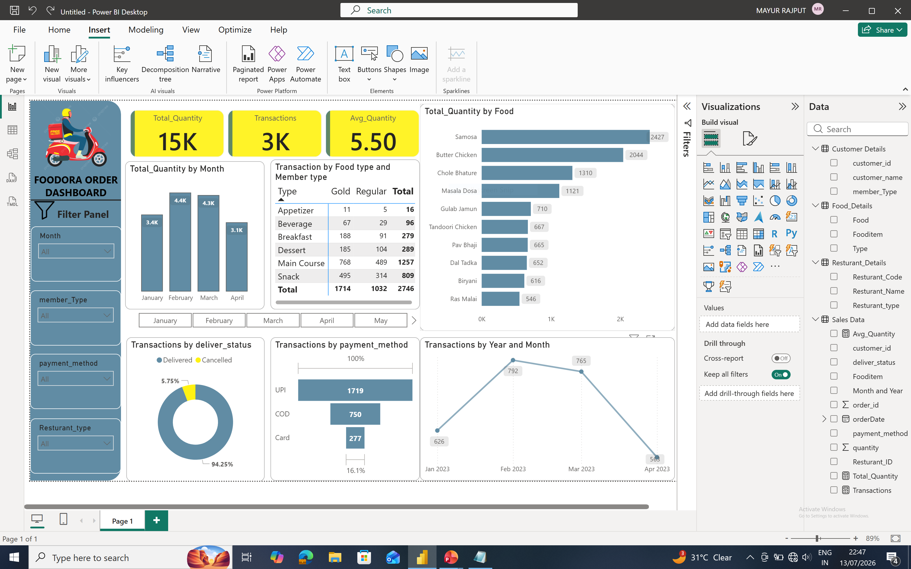

Dashboard Preview



---

# 🚀 Project Overview

This project is an interactive Foodora Sales Dashboard developed using Microsoft Power BI. It transforms raw sales data into meaningful business insights through interactive visualizations, KPIs, DAX measures, and Power Query. The dashboard enables users to analyze order trends, customer behavior, restaurant performance, delivery status, and payment methods efficiently.

---

# ✨ Features

- Interactive Filter Panel
  - Month
  - Member Type
  - Payment Method
  - Restaurant Type
- KPI Cards
  - Total Quantity
  - Total Transactions
  - Average Quantity
- Monthly Sales Analysis
- Food Item-wise Quantity Analysis
- Food Type & Member Type Analysis
- Delivery Status Analysis
- Payment Method Analysis
- Year-wise Transaction Trend
- Clean and Interactive Dashboard Design

---

# 🛠️ Technologies Used

- Microsoft Power BI
- Power Query
- DAX
- Data Modeling
- Data Cleaning
- Data Visualization

---

# 📊 Dataset

The dataset includes:

- Food Orders
- Customer Details
- Restaurant Details
- Food Categories
- Member Type
- Payment Method
- Delivery Status
- Monthly Sales Data

---

# 📂 Project Structure

```text
Dashboard/
Dataset/
Icons/
Image/
README.md
```

---

# 💡 Skills Demonstrated

- Data Cleaning
- Data Transformation
- Data Modeling
- DAX Measures
- Dashboard Design
- Business Intelligence
- Interactive Reporting
- Data Visualization

---

# 👨‍💻 Author

**Mayur Rajput**

B.Pharm + MBA (Integrated) Student | NMIMS

Passionate about Power BI, Excel, VBA, Data Analytics, Business Intelligence, and Process Automation.

⭐ If you found this project useful, don't forget to star this repository.
